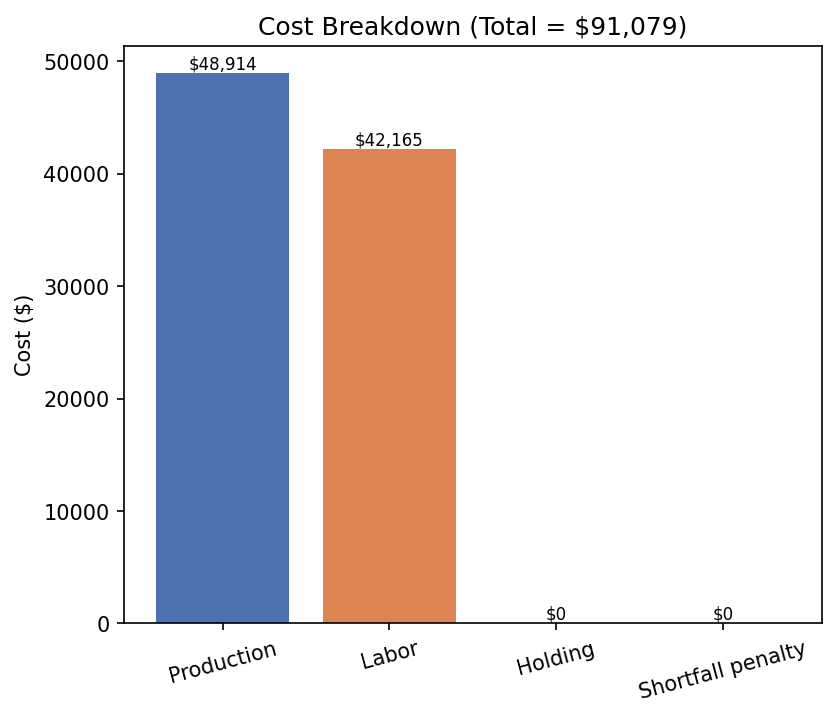
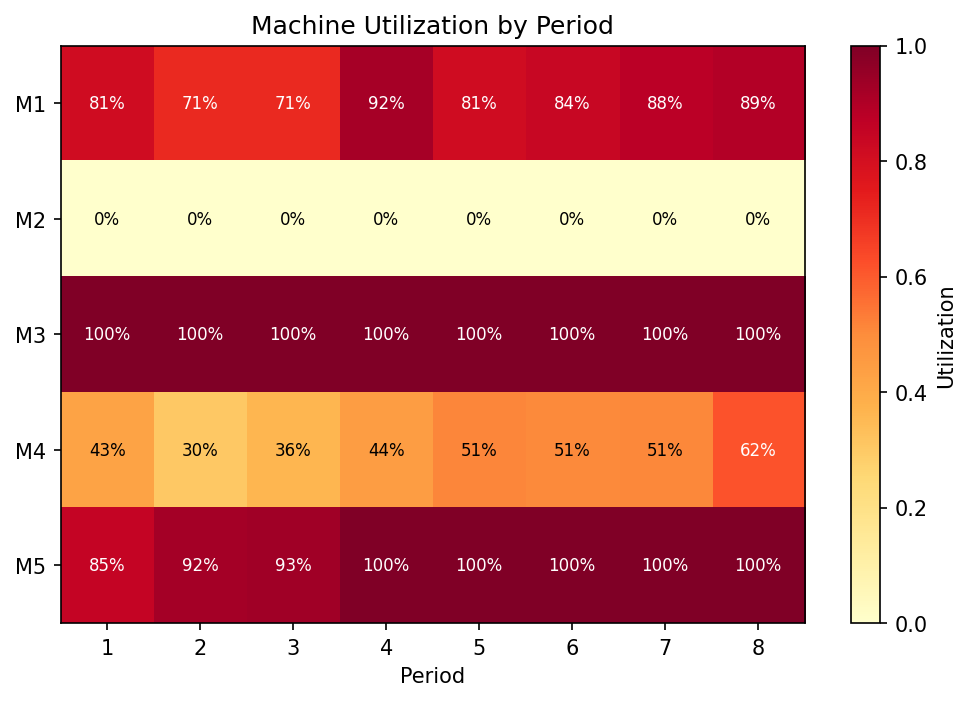
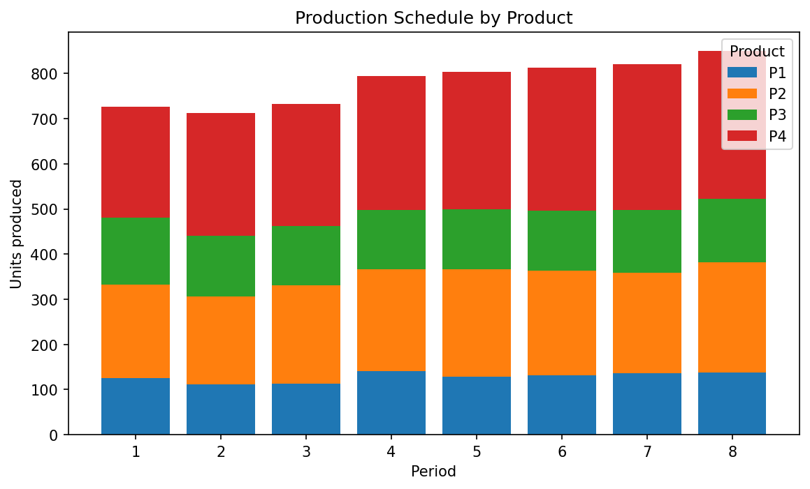
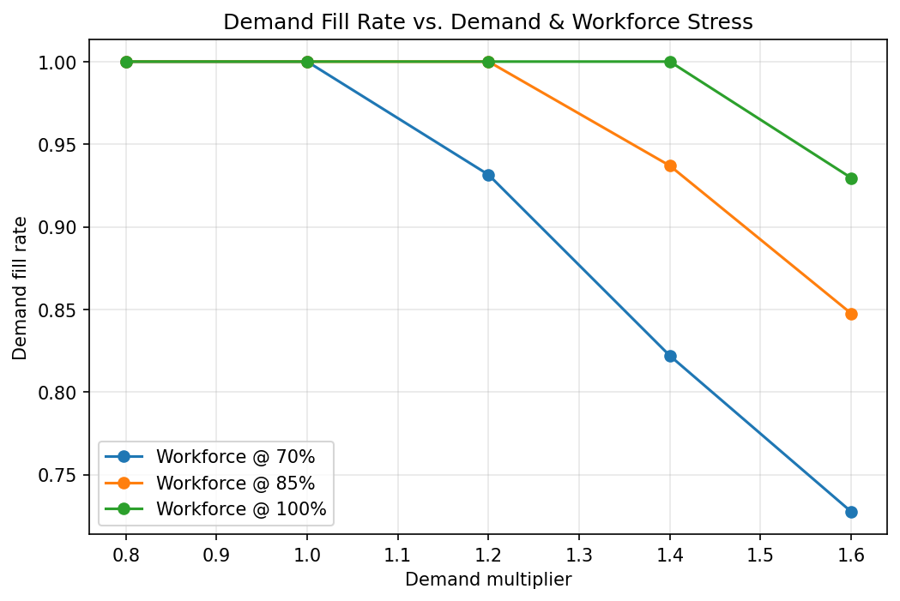

# Production Planning / Resource Allocation Optimizer


A linear-programming model that decides **what to produce, on which
machine, with which workforce, and when** — across multiple products,
multiple time periods, and limited machine and labor capacity — in order to
minimize total operational cost.

Built from scratch on top of `scipy.optimize.linprog` (HiGHS solver), with
no proprietary solver dependency. Includes a full scenario-analysis layer
that stress-tests the plan against demand surges and workforce shortages.

## What it does

- **Designs a production plan** that allocates machines, workers, and tasks
  across products and time periods while minimizing operational cost.
- **Formulates resource and demand constraints** as a linear program —
  machine-hour capacity, workforce-hour availability, and period-by-period
  demand — to maximize throughput and resource utilization.
- **Runs scenario analysis** across a demand × workforce-availability grid
  to find the production schedules that hold up, and the ones that don't.
- **Reports idle capacity and utilization** per machine and per worker type
  so you can see exactly where the slack — or the bottleneck — is.
- **Scales to more products, machines, or constraints** by editing four CSV
  files; nothing about the model size is hard-coded.

## The math

**Sets:** products $p$, machines $m$, worker types $k$, periods $t$.

**Decision variables**

| Variable | Meaning |
|---|---|
| $x_{p,m,t} \ge 0$ | units of product $p$ produced on machine $m$ in period $t$ |
| $I_{p,t} \ge 0$ | ending inventory of product $p$ in period $t$ |
| $L_{k,t} \ge 0$ | labor-hours of worker type $k$ used in period $t$ |
| $s_{p,t} \ge 0$ | unmet demand ("shortfall") of product $p$ in period $t$ |

**Objective — minimize total cost**

$$\min \sum_{p,m,t} c^{prod}_{p,m}\, x_{p,m,t} \;+\; \sum_{k,t} c^{labor}_k\, L_{k,t} \;+\; \sum_{p,t} c^{hold}_p\, I_{p,t} \;+\; \sum_{p,t} c^{penalty}\, s_{p,t}$$

**Subject to**

1. **Inventory balance** — production plus drawn-down inventory plus any
   shortfall must equal demand each period:
   $$I_{p,t-1} + \sum_m x_{p,m,t} + s_{p,t} - I_{p,t} = d_{p,t} \quad \forall p,t$$
2. **Machine capacity:**
   $$\sum_p \tau_{p,m}\, x_{p,m,t} \le H_{m,t} \quad \forall m,t$$
3. **Labor requirement** (a machine can't run without an operator of the
   matching skill type):
   $$\sum_{m \,:\, type(m)=k} \sum_p \tau_{p,m}\, x_{p,m,t} \;\le\; L_{k,t} \quad \forall k,t$$
4. **Labor availability:** $L_{k,t} \le W_{k,t}$

The shortfall variable $s_{p,t}$ carries a heavy penalty cost ($1,000/unit,
deliberately far above any real production cost) so the solver always
prefers to produce — it only appears when demand genuinely exceeds the
combined machine + labor capacity, which is exactly the signal you want
from a capacity-planning tool.

## Project structure

```
production-planning-optimizer/
├── data/                              sample dataset (CSV)
│   ├── products.csv                   holding costs per product
│   ├── machines.csv                   machine -> worker-type mapping
│   ├── product_machine_compatibility.csv   which products run on which machines, at what cost/speed
│   ├── demand.csv                     period-by-period demand
│   ├── machine_capacity.csv           period-by-period machine-hours available
│   └── worker_availability.csv        period-by-period labor-hours available, by type
├── scripts/
│   └── generate_sample_data.py        regenerates the dataset above (seeded, reproducible)
├── src/
│   ├── lp_builder.py                  small named-variable LP layer over scipy's HiGHS solver
│   ├── data_loader.py                 CSV -> structured PlanningData
│   ├── model.py                       the LP formulation above
│   ├── scenario.py                    demand x workforce grid scenario runner
│   └── visualize.py                   matplotlib charts
├── tests/
│   └── test_model.py                  constraint-satisfaction & correctness tests
├── outputs/                           generated charts + CSV reports (committed sample run)
├── main.py                            CLI entry point
└── requirements.txt
```

## Getting started

```bash
git clone https://github.com/Eslavath-Pinki/Production-Planning-Resource-Allocation-Optimizer.git
cd production-planning-optimizer
pip install -r requirements.txt

python main.py          # solves the baseline plan + runs scenario analysis
python -m pytest tests/ # verify all constraints hold
```

`main.py` prints a cost breakdown and utilization summary to the console,
and writes every chart and CSV below to `outputs/`. To plug in your own
data, just edit the CSVs in `data/` (or run
`python scripts/generate_sample_data.py` to regenerate a fresh synthetic
set) — no code changes are required for a different number of products,
machines, worker types, or periods.

## Results on the sample dataset

The sample instance models 4 products, 5 machines (2 worker types: CNC
*Skilled* and assembly/packaging *General*), over an 8-period horizon.

**Baseline plan: 100% demand fill, $91,079 total cost**

| Cost component | Amount |
|---|---:|
| Production | $48,914 |
| Labor | $42,165 |
| Holding | $0 |
| Shortfall penalty | $0 |



**Where the capacity actually goes** — the packaging line (M5) and one
assembly line (M3) run at or near 100% utilization throughout, while a
second CNC machine (M2) sits idle as flexible backup capacity. This is the
kind of finding a planner can act on directly (e.g. justify the unused M2
seat, or flag M3/M5 as the next bottleneck to expand):



**Production schedule** generated by the optimizer, by product and period:



### Scenario analysis: how far can the plan flex?

Re-solving across a grid of demand multipliers (80%–160% of baseline) and
workforce-availability multipliers (70%–100%) shows exactly where the plan
breaks down. At full workforce strength the plan absorbs up to a +40%
demand surge with no missed demand at all; it's only at +60% demand that
fill rate dips to 93%. Cut the workforce to 70% at the same time, though,
and the picture changes fast — fill rate starts slipping at just +20%
demand and falls to 73% by +60%, with total cost climbing sharply as the
shortfall penalty kicks in:



Full numeric results for all 15 scenarios are in
[`outputs/scenario_results.csv`](outputs/scenario_results.csv).

## Why scipy instead of PuLP / Pyomo / Gurobi

`scipy.optimize.linprog(method="highs")` wraps the HiGHS solver, the same
open-source solver many of those higher-level libraries call into. Building
directly on it keeps this project's dependency footprint to the standard
numpy/pandas/scipy/matplotlib stack — nothing extra to install — while
`src/lp_builder.py` adds back the readability (named variables, named
constraints) that's normally PuLP's selling point. Swapping in PuLP or a
commercial solver later would only require changing `lp_builder.py`; the
model formulation in `model.py` wouldn't change.

## Possible extensions

- Multi-stage routing (a product visiting several machines in sequence)
- Setup/changeover costs when switching products on a machine
- Overtime labor as a separate, more expensive variable instead of a hard cap
- Rolling-horizon re-planning (re-optimize each period as actual demand arrives)
